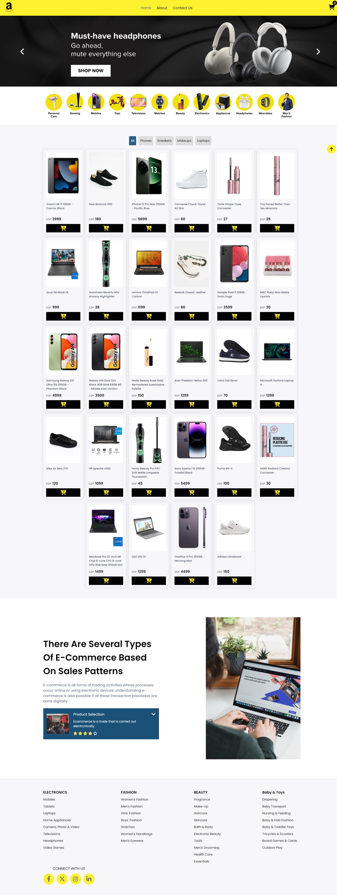
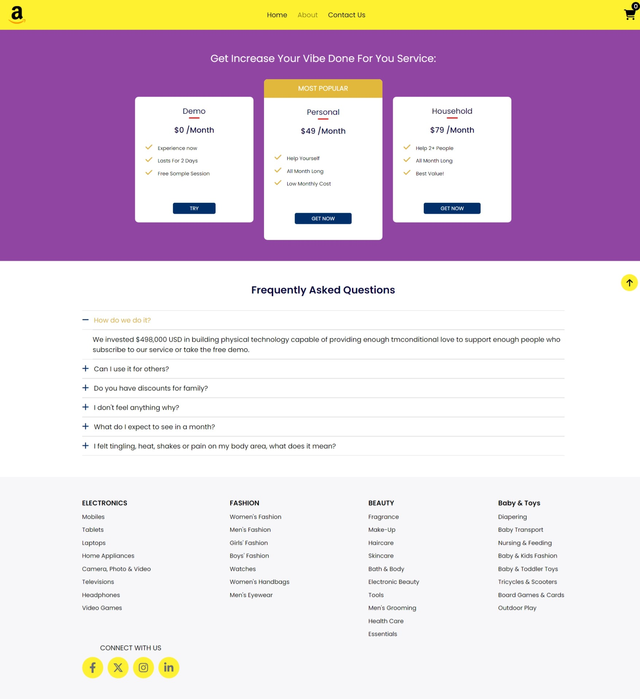
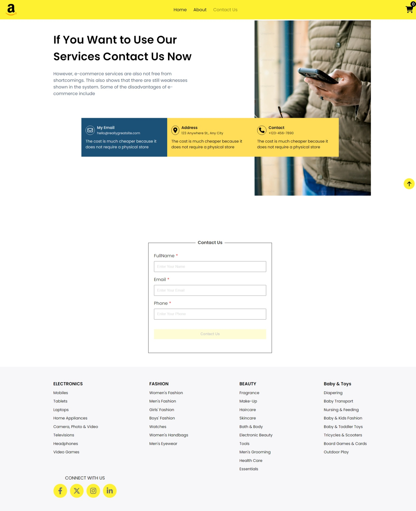
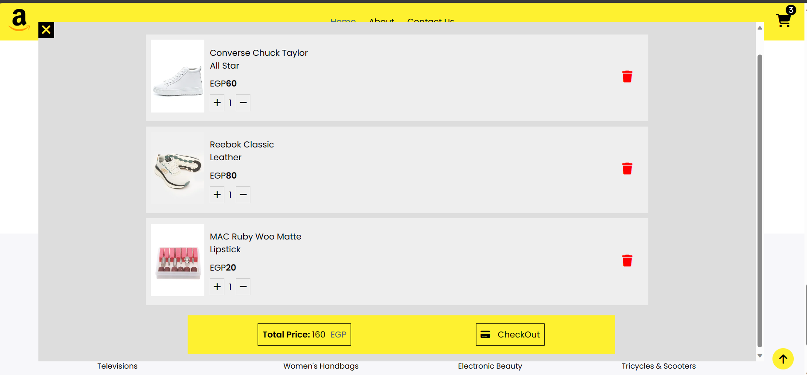

# E-Commerce Website
### Deployment :- https://iti-ecommerce-project.netlify.app/
---
### Description :-
- includes 4 pages (home, about, contactus, cart ) 
- can filter products
- add products to cart
- show cart page
- delete products
- change amount of product and calulate total amount
- validation on contactus form
- responsive on all screens

---
### Tools :-

-  HTML5 - CSS3 - JavaScript

---
### Design :- 
Home Page

Aboutus Page

Contactus Page

Cart Page

